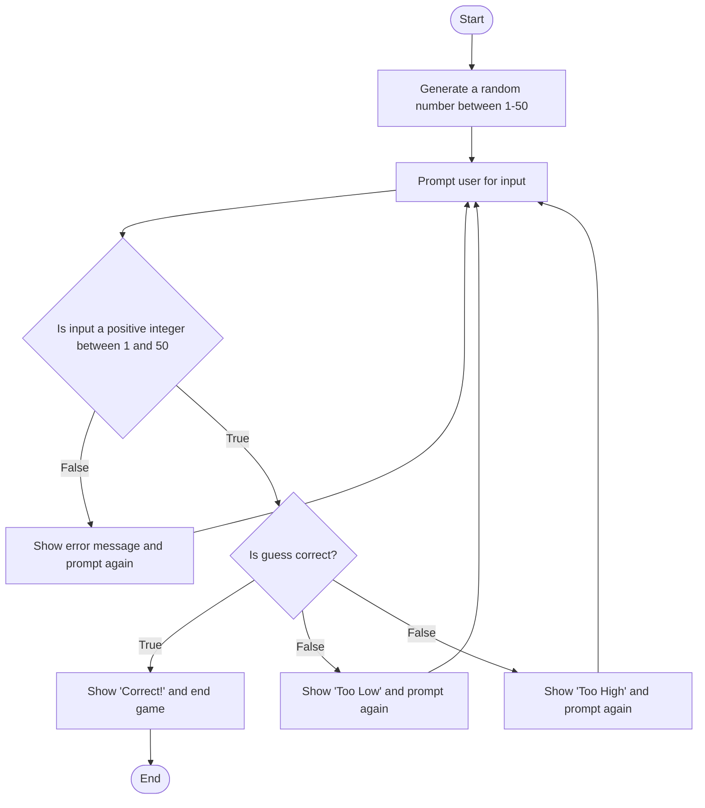

# **Game Procedures**
## *Start Game*
### Steps
1. The compter generates a randome number
2. The Compter promps the user for a integer between 1 and 50
3. The user enters a positive integer between 1 and 50
4. The computer sees if the number is a positive integer and is between 1 and 50. If the input doesn't match it throws an error and requests an input
5. Computer evalutes the integer. If the number is correct it ends the game. If integer is not correct it evaluates the input and either tells user it is too high or too low and requests another input from user
6. When the user guess matches the number the computer responses with 'correct' and ends the game
